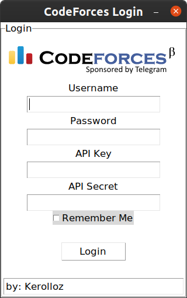
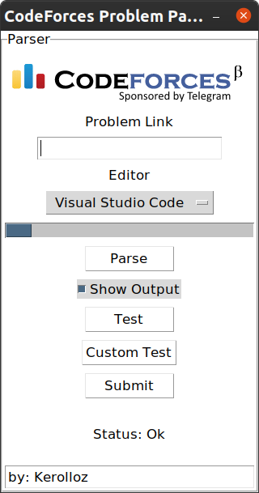

# Codeforcify [](https://travis-ci.com/kerolloz/codeforcify)

  
Problem Solving Made **_Easy_**  
_currently we support **C++** solutions only_

- [Requirements Installation](#requirements-installation)
- [Usage](#how-to-use)

## Requirements Installation

You should have python3, python3-pip & python3-tk installed

```bash
sudo apt install make python3 python3-pip python3-tk
```

Then after cloning the repository,
Install requirements using pip3

```bash
pip3 install -r requirements.txt
```

## How to use

1. Run the Parser from the terminal

   ```bash
   python3 main.py
   ```

1. Login to CodeForces.  
   **NOTE:** API key & API secret are optional(helpful in case of private submissions).  
   
1. Copy and paste the problem link, choose an editor.  
   
1. Press **Parse**.
1. The chosen editor will open up with some [pre-written code](/utils/template.cpp). Write your solution & save.
1. Press **Test**.
1. If ACCEPTED, Press **Submit**.

## How it works

The parser will save your login info (if you choose so) in `.user_data.json` file in the root directory of the parser.
The parser will automatically login if there is any saved info.
The parser will parse the input and output in the problem test cases.
The parser will open a template with the editor you choose.
The parser will test the solution on the sample inputs and outputs of the problem.
The parser can test the solution on a given custom input.
The parser will submit the solution of the problem and wait for the verdict.

---

> Give me the problem link, write your solution, I will do the rest for you...

**</>** with :heart: by **Kerollos Magdy**  
Made for **Linux** :penguin:
