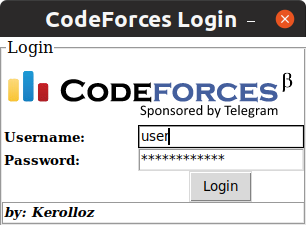
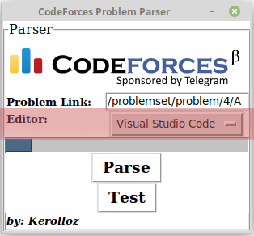

# Codeforcify [](https://travis-ci.com/kerolloz/codeforcify)

  
Problem Solving Made **_Easy_**  
_currently we support **c++** solutions only_

- [Requirements Installation](https://github.com/kerolloz/codeforcify#requirements-installation)
- [Usage](https://github.com/kerolloz/codeforcify#how-to-use)

## Requirements Installation

You should have python3, python3-pip & python3-tk installed

```bash
sudo apt install python3 python3-pip python3-tk
```

Then after cloning the repository,
Install requirements using pip3

```bash
pip3 install -r requirements.txt
```

## How to use

1. Run the Parser from the terminal

   ```bash
   python3 main.py
   ```

1. Login to CodeForces. **NOTE:** API key & API secret are optional(helpful in case of private submissions).  
   
1. Copy and paste the problem link, choose an editor.  
   
1. Press **Parse**.
1. The chosen editor will open up with some [pre-written code](/utils/template.cpp). Write your solution & save.
1. Press **Test**.
1. If ACCEPTED, Press **Submit**.

---

> Give me the problem link, write your solution, I will do the rest for you...

**</>** with :heart: by **Kerollos Magdy**  
Made for **Linux** :penguin:
